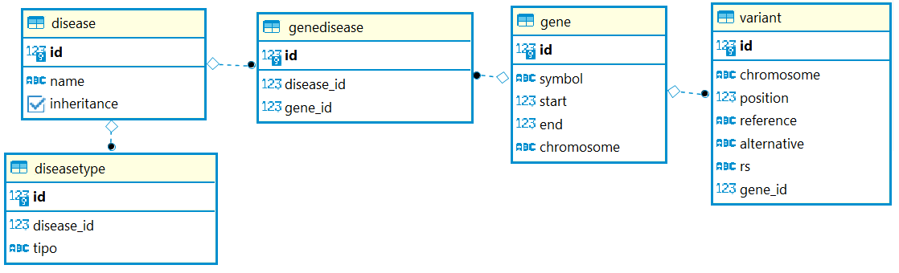

# BITGENIA - Django Test Concept .

This project responds to `./Test Concepto Django.pdf` file.

# How to run
### 1. Clone the repository
### 2. Install dependencies
### 3. Set DB
Set your Data Base on `./testconcept_project/settings.py` file and put your pass in `./testconcept_project/creeds.py`. If the file is not there, create it with this:
```py
    postgres = 'YoUr_P4sSW0rd' 
```
### 4. Migrate DB:
```powershell                      
    py manage.py migrate --run-syncdb
```                      
### 5. Populate with test data:
```powershell                      
    py manage.py shell 
```
```py
    exec(open('populator.py').read()) 
```
### 6. Create User:
```powershell
   py manage.py createsuperuser
   name:  admin
   email: admin@admin.com
   pass:  admin

```

### 7. Run server:
```powershell                      
    py manage.py runserver
```                      
## DB:
Data base data is in `./data` folder.
The Db have the next schema:

## Helper:
Case error:
    ``` "ValuesError: attempted relative import beyond top-level package" ```
Caused by :    
    ``` from .. ``` 

Use:
```py
    import sys
    from os import path
    sys.path.append(path.dirname(path.dirname(path.abspath(__file__))))
    from gene_register.models import Gene
```

### References
 * [Getting Started](https://docs.djangoproject.com/en/3.2/intro/)
 * [Example CRUD Employes - Youtube](https://www.youtube.com/watch?v=N6jzspc2kds)
 * [Example CRUD Employes - github](https://github.com/CodAffection/Django-CRUD-Operations)
